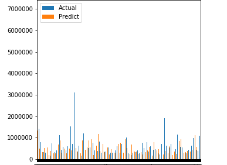

# A Regression based Prediction Algorithm
In this repository, I make a model for predicting housing prices based on previous training data. This model is able to predict the future house prices with great accuracy.

## Dataset 
I have used a housing dataset from [Kaggle](https://www.kaggle.com/). It can be found [here](dataset/kc_house_data.csv).
## Accuracy Plot
The regression score is quite high due to using ```GradientBoostingRegressor``` 
```
regression score = 90.7%
```
We can also use ```LinearRegression```

I also showed a graph comparing the real price and the predicted price by the regression model.
this graph is like below:


